# Лабораторна робота 1. Робота з СУБД PostgreSQL та основи SQL

## Загальна інформація

**Здобувач освіти:** Віннік Артем
**Група:** ІПЗ-31
**Обраний рівень складності:** 3

## Виконання завдань

### Список таблиць

```sql
SELECT table_name 
FROM information_schema.tables 
WHERE table_schema = 'public' 
ORDER BY table_name;
```
Результат: У базі даних створено 8 основних таблиць: categories, customers, employees, order_items, orders, products, regions, suppliers.

## РІВЕНЬ 1

### 1.1. Отримати всі записи з таблиці customers
```sql 
SELECT * FROM customers;
```
Результат: Отримано всі записи з даними клієнтів. 
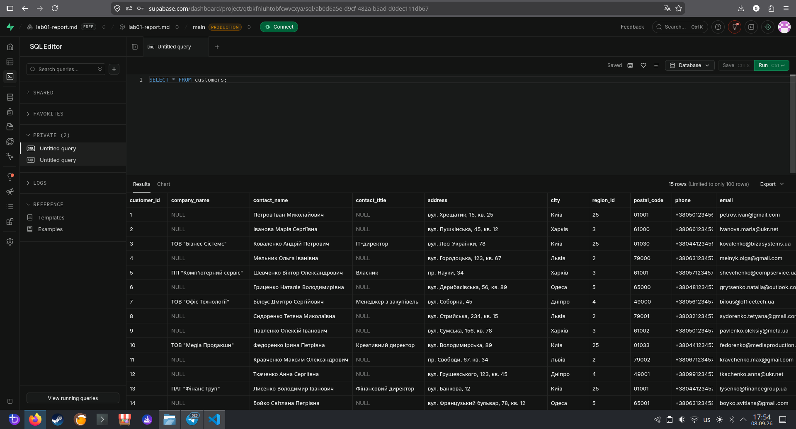

### 1.2 Вивести тільки назви товарів і їхні ціни з таблиці products

```sql
SELECT product_name, unit_price FROM products;
```
Результат: Виведено дві колонки: назва товару та його ціна.
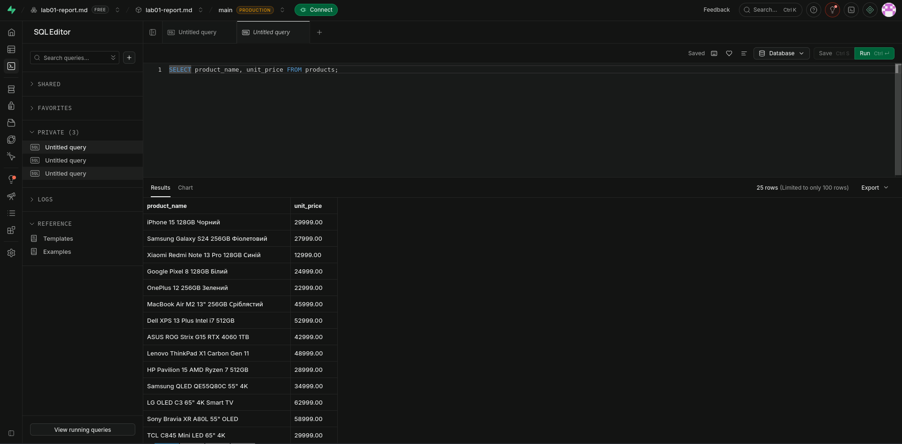

### 1.3. Показати контактні дані всіх співробітників
```sql
SELECT first_name, last_name, phone, email FROM employees;
```
Результат: Отримано імена, прізвища та контакти працівників.
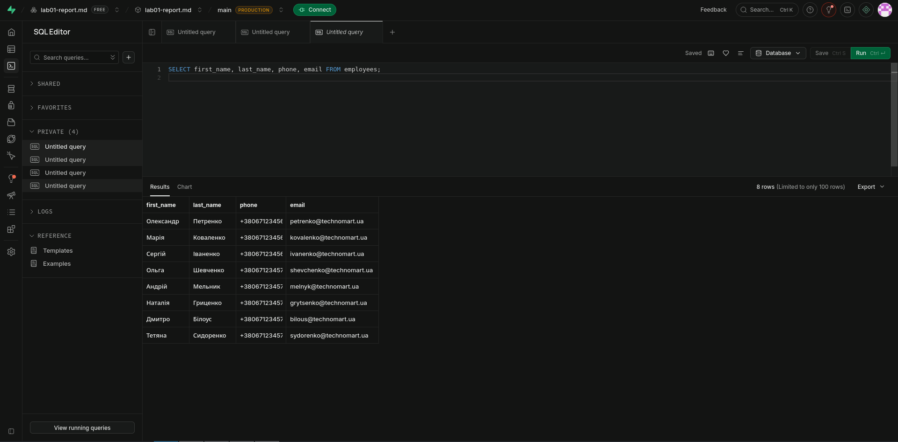

### 1.4. Знайти всіх клієнтів з міста Київ

```sql
SELECT * FROM customers WHERE city = 'Київ';
```
Результат: Відфільтровано базу, показано лише киян.
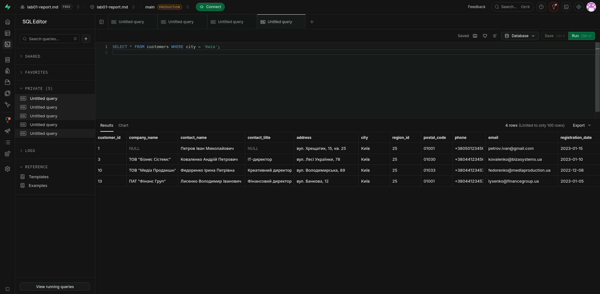

### 1.5. Вивести товари, які коштують більше 25000 грн

```sql
SELECT * FROM products WHERE unit_price > 25000;
```
Результат: Показано преміум-сегмент товарів.
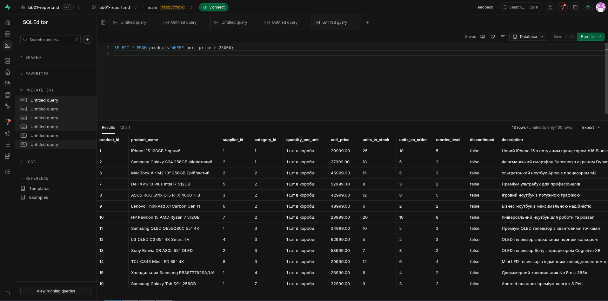

### 1.6. Показати всі замовлення зі статусом 'delivered'

```sql
-- Оскільки стовпець status відсутній у базі, шукаємо доставлені замовлення за наявністю дати відправки
SELECT * FROM orders WHERE shipped_date IS NOT NULL;
```
Результат: Виведено список успішно доставлених замовлень.
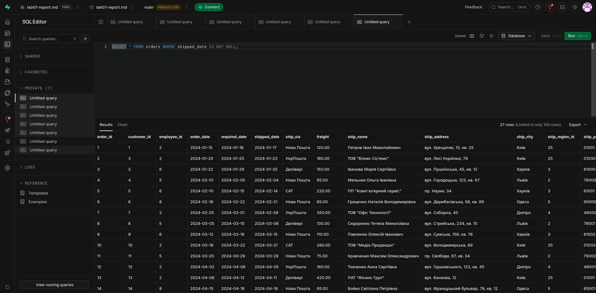

### 1.7. Показати перші 10 найдорожчих товарів

```sql
SELECT * FROM products ORDER BY unit_price DESC LIMIT 10;
```
Результат: Топ-10 товарів відсортованих за спаданням ціни.
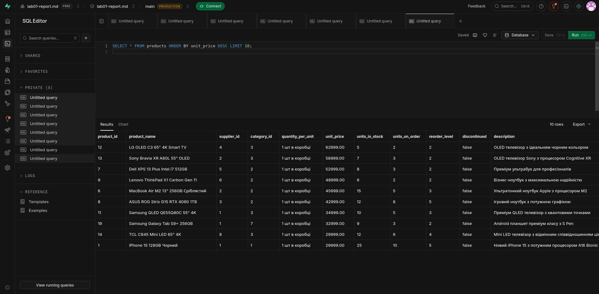

## РІВЕНЬ 2

### 2.1. Знайти всіх клієнтів, чиї імена починаються на "Іван"
```sql
SELECT * FROM customers WHERE contact_name LIKE 'Іван%';
```
Результат: Знайдено клієнтів з іменем Іван.
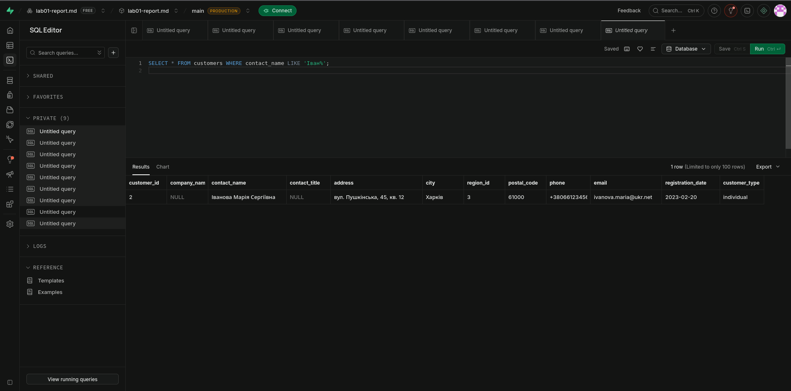

### 2.2. Самостійно: Аналіз попиту на аудіообладнання (LIKE)
```sql
-- Пошук мікрофонів та навушників для звукорежисерів
SELECT product_name, unit_price 
FROM products 
WHERE product_name ILIKE '%мікрофон%' OR product_name ILIKE '%навушники%';
```
Результат: Виведено товари, пов'язані зі звукозаписом.
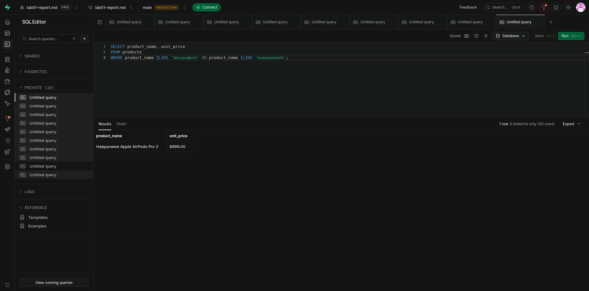

### 2.3. Самостійно: Пошук перспективних локацій для розширення (AND, OR)
```sql
-- Пошук B2B клієнтів у Волинській та Рівненській областях
SELECT contact_name, city, customer_type 
FROM customers 
WHERE (city = 'Луцьк' OR city = 'Рівне') AND customer_type = 'company';
```
Результат: Знайдено B2B клієнтів у західному регіоні.
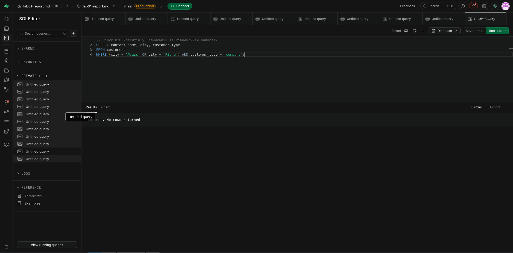

### 2.4. Самостійно: Контроль якості контактних даних (IS NULL)
```sql
-- Пошук профілів клієнтів без електронної пошти
SELECT contact_name, phone 
FROM customers 
WHERE email IS NULL;
```

Результат: Виведено клієнтів без email-адрес.
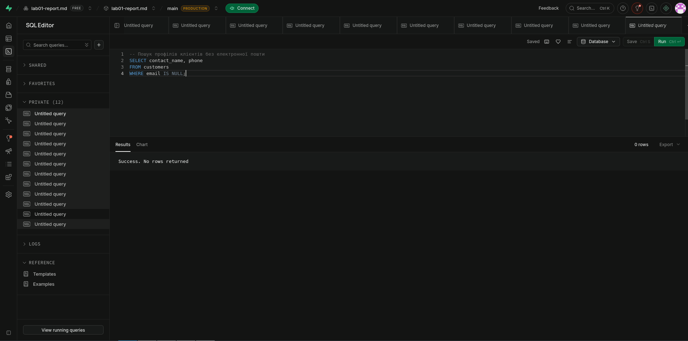

### 2.5. Самостійно: Складне сортування та пагінація каталогу
```sql
-- Виведення другої сторінки інтернет-магазину (записи з 11 по 20)
SELECT product_name, unit_price, units_in_stock 
FROM products 
ORDER BY units_in_stock DESC, unit_price ASC 
LIMIT 10 OFFSET 10;
```
Результат: Виведено записи для пагінації каталогу.
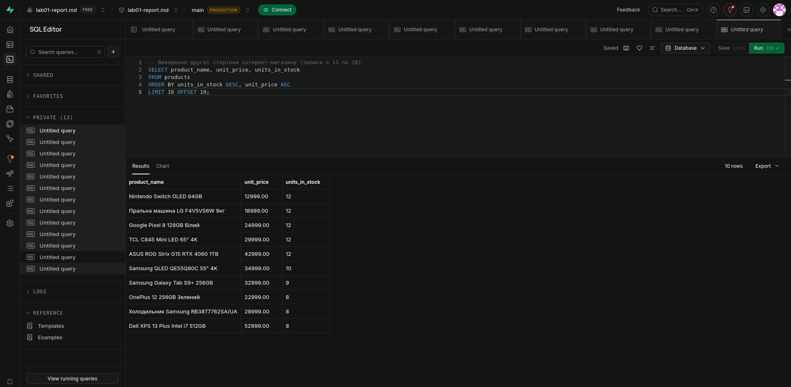

## РІВЕНЬ 3

### 3.1. Складні комбінації LIKE з логічними операторами
```sql
SELECT * FROM products 
WHERE (product_name ILIKE '%Samsung%' OR product_name ILIKE '%Apple%') 
AND product_name NOT ILIKE '%чохол%';
```
Результат: Знайдено техніку брендів, виключено аксесуари.
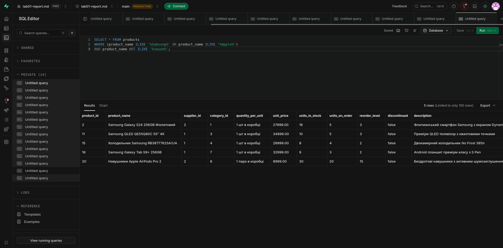

### 3.2. Самостійно: Аналітичний звіт з кіберспортивного сегменту
```sql
-- Пошук високопродуктивних комплектуючих для геймерів
SELECT product_name, unit_price, units_in_stock
FROM products 
WHERE unit_price BETWEEN 15000 AND 80000 
AND units_in_stock > 0 
AND (product_name ILIKE '%монітор%' OR product_name ILIKE '%відеокарта%')
AND description IS NOT NULL
ORDER BY unit_price DESC;
```
Результат: Згенеровано збірку преміального комп'ютерного обладнання.
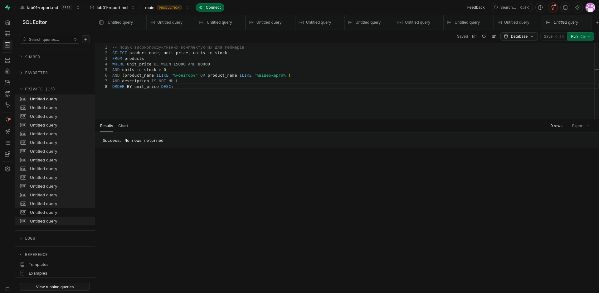

### 3.3. Самостійно: Аналіз часових патернів у логістиці
```sql
-- Виявлення замовлень, які досі не відправлені
SELECT order_id, order_date
FROM orders 
WHERE order_date BETWEEN '2023-01-01' AND '2024-01-01' 
AND shipped_date IS NULL 
ORDER BY order_date ASC;
```
Результат: Отримано список проблемних замовлень для відділу логістики.
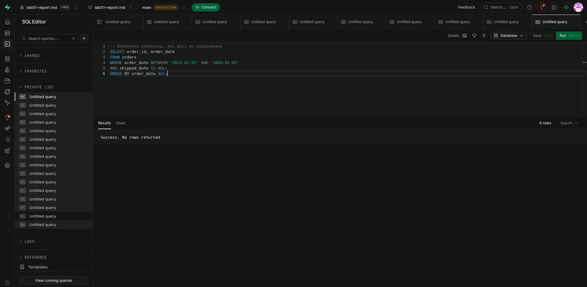

### Висновки

### Самооцінка: 5

### Обгрунтування: 

Виконано всі завдання трьох рівнів складності. 

Написано комплексні SQL-запити з використанням фільтрації, логічних операторів та пагінації. 

Продемонстровано розуміння бізнес-логіки.
