## Загальна інформація

**Здобувач освіти:** Віннік Артем  
**Група:** ІПЗ-31  
**Обраний рівень складності:** 3

---

# Виконання завдань

## Рівень 1

### 1. З'єднання таблиць

### Завдання 1.1. INNER JOIN — список товарів з категоріями та постачальниками

```sql
SELECT
    p.product_name,
    c.category_name,
    s.company_name,
    p.unit_price
FROM products p
INNER JOIN categories c
    ON p.category_id = c.category_id
INNER JOIN suppliers s
    ON p.supplier_id = s.supplier_id
ORDER BY c.category_name, p.product_name;
```

**Результат виконання:**

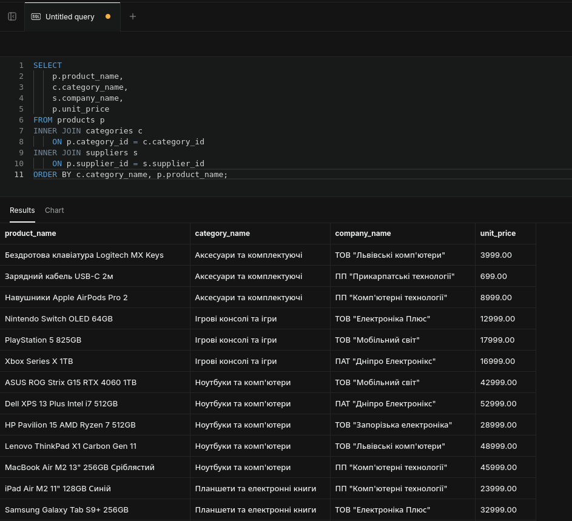

**Пояснення:**  
Запит об'єднує таблиці `products`, `categories` та `suppliers`.
За допомогою `INNER JOIN` для кожного товару отримується назва
його категорії та постачальника. У результат потрапляють лише ті
товари, для яких існують відповідні записи у пов'язаних таблицях.

---

### Завдання 1.2. LEFT JOIN — клієнти з кількістю замовлень

```sql
SELECT
    c.contact_name,
    c.customer_type,
    r.region_name,
    COUNT(o.order_id) AS order_count
FROM customers c
LEFT JOIN orders o
    ON c.customer_id = o.customer_id
LEFT JOIN regions r
    ON c.region_id = r.region_id
GROUP BY
    c.customer_id,
    c.contact_name,
    c.customer_type,
    r.region_name
ORDER BY order_count DESC;
```

**Результат виконання:**

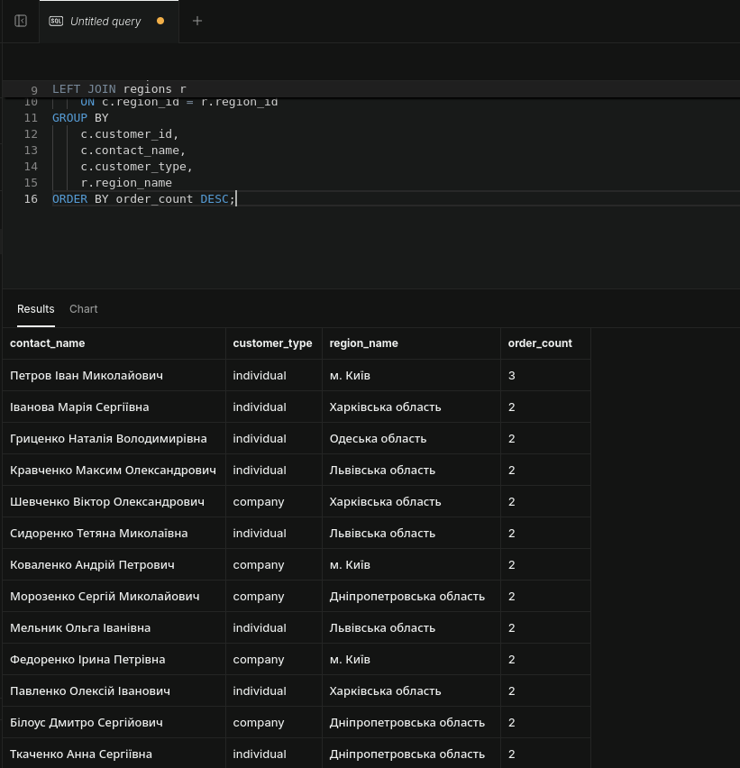

**Пояснення:**  
На відміну від `INNER JOIN`, оператор `LEFT JOIN` повертає всі записи
з лівої таблиці `customers`, навіть якщо для клієнта немає відповідних
замовлень. У такому випадку кількість замовлень дорівнює 0.
`INNER JOIN` повертав би тільки клієнтів, які мають відповідні записи
в таблиці замовлень.

---

### Завдання 1.3. Множинне з'єднання — детальна інформація про замовлення

```sql
SELECT
    o.order_id,
    o.order_date,
    cu.contact_name,
    p.product_name,
    c.category_name,
    oi.quantity,
    oi.unit_price,
    oi.discount,
    ROUND(
        oi.quantity * oi.unit_price * (1 - oi.discount),
        2
    ) AS total_price
FROM orders o
JOIN customers cu
    ON o.customer_id = cu.customer_id
JOIN order_items oi
    ON o.order_id = oi.order_id
JOIN products p
    ON oi.product_id = p.product_id
JOIN categories c
    ON p.category_id = c.category_id
ORDER BY o.order_date DESC, o.order_id;
```

**Результат виконання:**

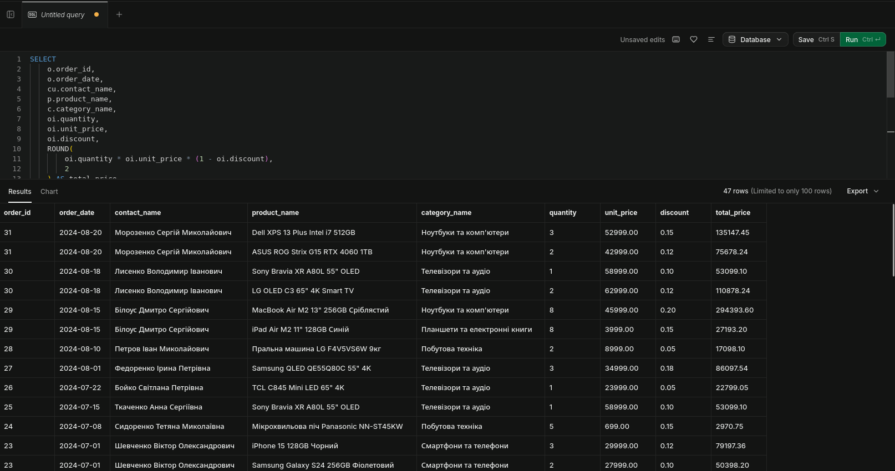

**Аналіз складності:**  
Запит з'єднує п'ять таблиць: `orders`, `customers`, `order_items`,
`products` та `categories`. Спочатку замовлення пов'язуються з клієнтами,
після чого через таблицю `order_items` додаються позиції замовлень.
Потім для кожної позиції отримується інформація про товар і його
категорію. Додатково обчислюється підсумкова вартість позиції з
урахуванням кількості та знижки.

---

## 2. Агрегатні функції

### Завдання 2.1. Статистика товарів за категоріями

```sql
SELECT
    c.category_name,
    COUNT(p.product_id) AS product_count,
    ROUND(AVG(p.unit_price), 2) AS avg_price,
    MIN(p.unit_price) AS min_price,
    MAX(p.unit_price) AS max_price
FROM categories c
LEFT JOIN products p
    ON c.category_id = p.category_id
GROUP BY c.category_id, c.category_name
ORDER BY product_count DESC;
```

**Результат виконання:**

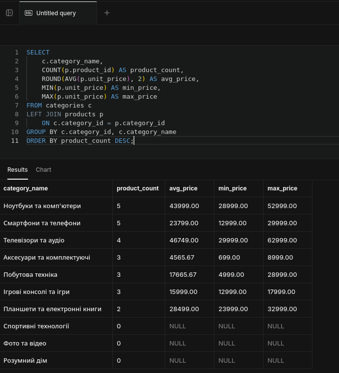

**Пояснення:**  
Запит групує товари за категоріями та використовує агрегатні функції:
`COUNT()` для визначення кількості товарів, `AVG()` для середньої ціни,
`MIN()` для мінімальної ціни та `MAX()` для максимальної ціни.

---

### Завдання 2.2. Продажі за регіонами з використанням HAVING

```sql
SELECT
    r.region_name,
    COUNT(DISTINCT o.order_id) AS orders_count,
    ROUND(
        SUM(oi.quantity * oi.unit_price * (1 - oi.discount)),
        2
    ) AS total_sales
FROM regions r
JOIN customers c
    ON c.region_id = r.region_id
JOIN orders o
    ON o.customer_id = c.customer_id
JOIN order_items oi
    ON oi.order_id = o.order_id
WHERE o.order_status = 'delivered'
GROUP BY r.region_id, r.region_name
HAVING SUM(
    oi.quantity * oi.unit_price * (1 - oi.discount)
) > 0
ORDER BY total_sales DESC;
```

**Результат виконання:**

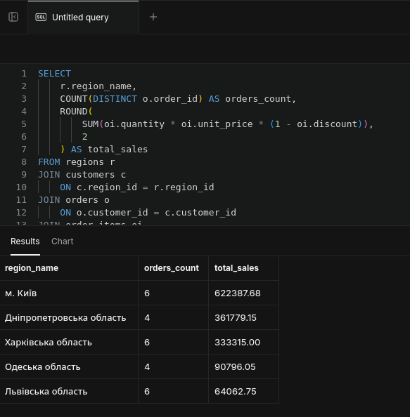

**Пояснення:**  
Запит визначає кількість доставлених замовлень і загальний обсяг
продажів для кожного регіону. `WHERE` використовується для відбору
доставлених замовлень до групування, а `HAVING` фільтрує вже
сформовані групи та залишає регіони, у яких сума продажів більша 0.

---

### Завдання 2.3. Постачальники з кількістю товарів більше 2

```sql
SELECT
    s.supplier_id,
    s.company_name,
    COUNT(p.product_id) AS product_count
FROM suppliers s
JOIN products p
    ON s.supplier_id = p.supplier_id
GROUP BY s.supplier_id, s.company_name
HAVING COUNT(p.product_id) > 2
ORDER BY product_count DESC;
```

**Результат виконання:**

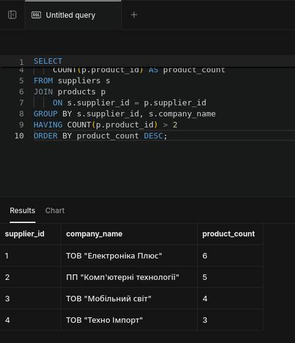

**Пояснення:**  
Товари групуються за постачальниками, після чого функція `COUNT()`
визначає кількість товарів кожного постачальника. За допомогою
`HAVING` вибираються тільки постачальники, які мають більше двох товарів.

---

# 3. Базові підзапити

### Завдання 3.1. Товари з ціною вище середньої по категорії

```sql
SELECT
    p.product_name,
    p.unit_price,
    c.category_name
FROM products p
INNER JOIN categories c
    ON p.category_id = c.category_id
WHERE p.unit_price > (
    SELECT AVG(p2.unit_price)
    FROM products p2
    WHERE p2.category_id = p.category_id
)
ORDER BY c.category_name, p.unit_price DESC;
```

**Результат виконання:**

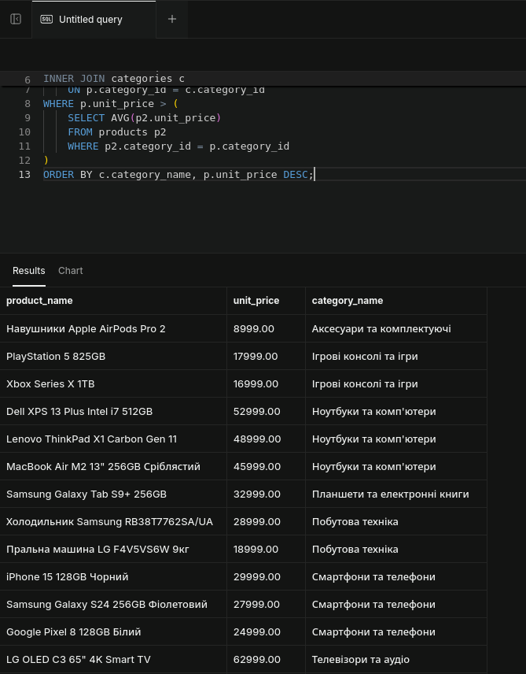

**Пояснення:**  
Використано корельований підзапит, який для кожного товару визначає
середню ціну товарів у його категорії. У результат потрапляють товари,
ціна яких більша за середню ціну відповідної категорії.

---

### Завдання 3.2. Клієнти з замовленнями у 2024 році

```sql
SELECT
    customer_id,
    contact_name,
    company_name,
    city
FROM customers
WHERE customer_id IN (
    SELECT customer_id
    FROM orders
    WHERE order_date >= '2024-01-01'
      AND order_date < '2025-01-01'
)
ORDER BY contact_name;
```

**Результат виконання:**

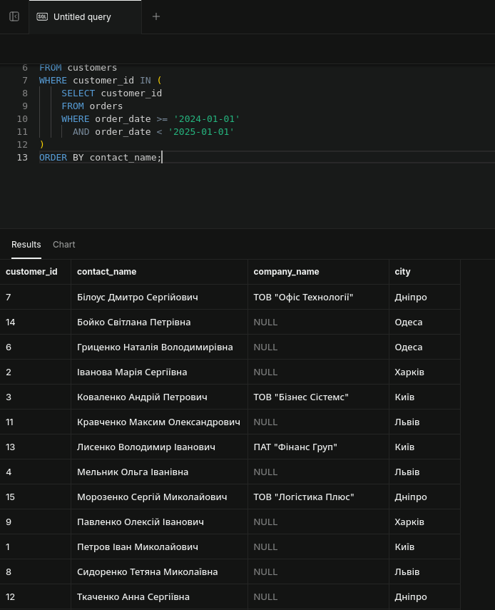

**Пояснення:**  
Внутрішній запит знаходить ідентифікатори клієнтів, які здійснювали
замовлення протягом 2024 року. Оператор `IN` використовується для
вибору відповідних клієнтів із таблиці `customers`.

---

### Завдання 3.3. Товари із загальною кількістю продажів

```sql
SELECT
    p.product_id,
    p.product_name,
    p.unit_price,
    (
        SELECT COALESCE(SUM(oi.quantity), 0)
        FROM order_items oi
        WHERE oi.product_id = p.product_id
    ) AS total_quantity_sold
FROM products p
ORDER BY total_quantity_sold DESC;
```

**Результат виконання:**

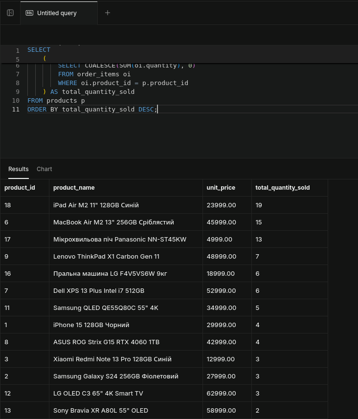

**Пояснення:**  
Для кожного товару виконується підзапит у секції `SELECT`.
Він підраховує загальну кількість проданих одиниць товару.
Функція `COALESCE()` замінює значення `NULL` на 0 для товарів,
які ще не продавалися.

---

# Рівень 2

## 4. Складні з'єднання

### Завдання 4.1. RIGHT JOIN — аналіз категорій та товарів

```sql
SELECT
    c.category_name,
    COUNT(p.product_id) AS products_count,
    COALESCE(AVG(p.unit_price), 0) AS avg_price
FROM products p
RIGHT JOIN categories c
    ON p.category_id = c.category_id
GROUP BY c.category_id, c.category_name
ORDER BY products_count DESC;
```

**Результат виконання:**

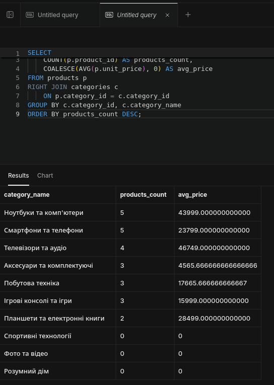

**Пояснення:**  
`RIGHT JOIN` забезпечує виведення всіх категорій, навіть якщо в певній
категорії немає товарів. Для кожної категорії визначається кількість
товарів та їх середня ціна.

---

### Завдання 4.2. Self-join — співробітники та керівники

```sql
SELECT
    e1.first_name || ' ' || e1.last_name AS employee,
    e1.title AS employee_title,
    e2.first_name || ' ' || e2.last_name AS manager,
    e2.title AS manager_title
FROM employees e1
LEFT JOIN employees e2
    ON e1.reports_to = e2.employee_id
ORDER BY e2.last_name, e1.last_name;
```

**Результат виконання:**

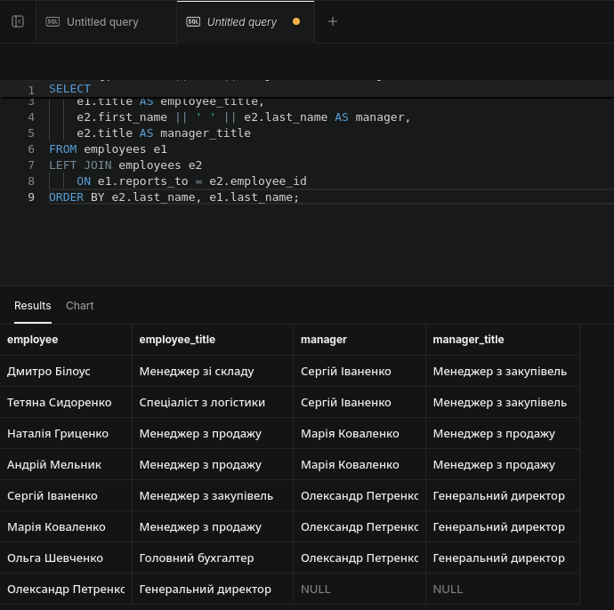

**Пояснення:**  
У цьому запиті таблиця `employees` з'єднується сама із собою.
Псевдонім `e1` використовується для працівника, а `e2` — для його
керівника. Зв'язок встановлюється через поле `reports_to`.

---

# 5. Віконні функції

### Завдання 5.1. Ранжування товарів за ціною в категоріях

```sql
SELECT
    p.product_name,
    c.category_name,
    p.unit_price,

    RANK() OVER (
        PARTITION BY c.category_name
        ORDER BY p.unit_price DESC
    ) AS price_rank,

    DENSE_RANK() OVER (
        PARTITION BY c.category_name
        ORDER BY p.unit_price DESC
    ) AS price_dense_rank,

    ROW_NUMBER() OVER (
        PARTITION BY c.category_name
        ORDER BY p.unit_price DESC
    ) AS row_num

FROM products p
JOIN categories c
    ON p.category_id = c.category_id
ORDER BY c.category_name, p.unit_price DESC;
```

**Результат виконання:**

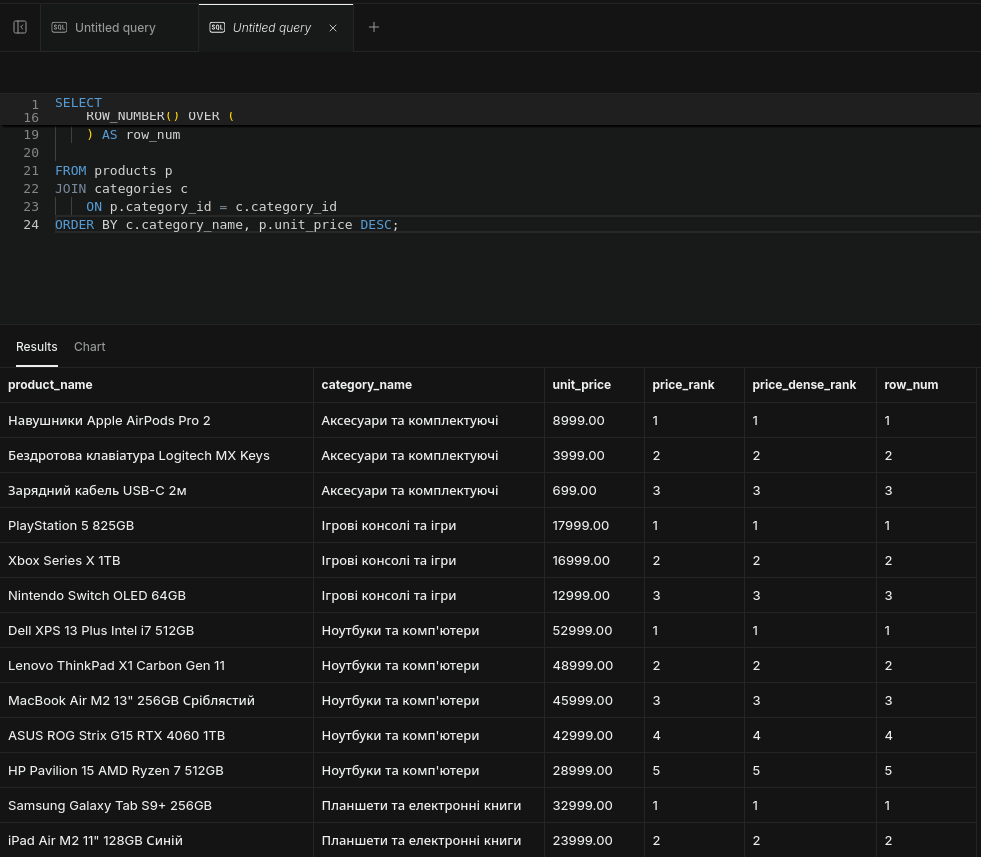

**Пояснення:**  
Віконні функції виконують ранжування товарів окремо в межах кожної
категорії. `RANK()` залишає пропуски у рангах при однакових значеннях,
`DENSE_RANK()` не створює пропусків, а `ROW_NUMBER()` присвоює кожному
рядку унікальний порядковий номер.

---

### Завдання 5.2. Порівняння замовлень з попередніми датами

```sql
SELECT
    c.contact_name,
    o.order_id,
    o.order_date,

    LAG(o.order_date) OVER (
        PARTITION BY o.customer_id
        ORDER BY o.order_date
    ) AS previous_order,

    LEAD(o.order_date) OVER (
        PARTITION BY o.customer_id
        ORDER BY o.order_date
    ) AS next_order

FROM orders o
JOIN customers c
    ON o.customer_id = c.customer_id
ORDER BY c.contact_name, o.order_date;
```

**Результат виконання:**

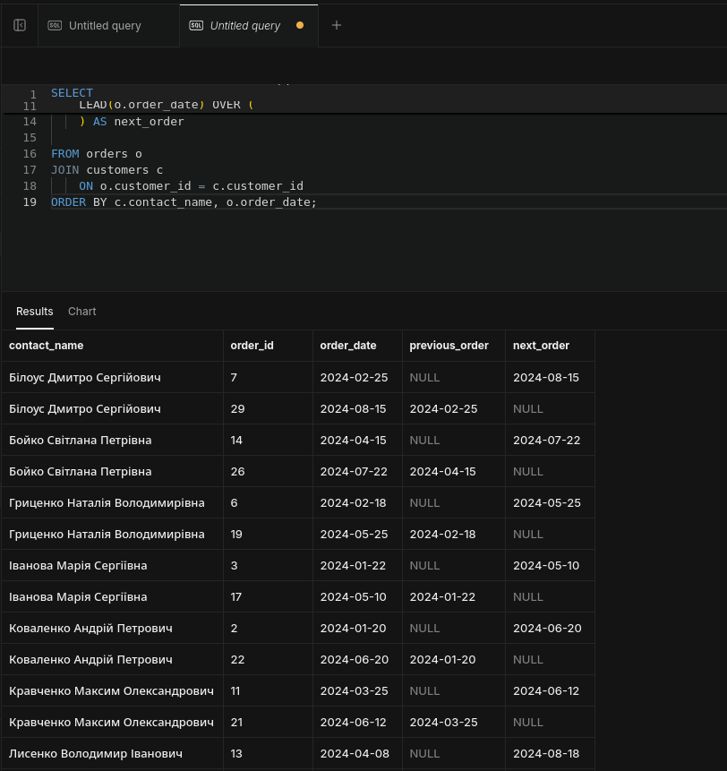

**Пояснення:**  
Функція `LAG()` дозволяє отримати дату попереднього замовлення клієнта,
а `LEAD()` — дату наступного замовлення. Дані розбиваються на групи
за клієнтом за допомогою `PARTITION BY`.

---

# Рівень 3

## 6. Матеріалізовані представлення та рекурсивні запити

### Завдання 6.1. Матеріалізоване представлення для аналізу продажів

```sql
CREATE MATERIALIZED VIEW mv_monthly_sales AS
SELECT
    EXTRACT(YEAR FROM o.order_date) AS year,
    EXTRACT(MONTH FROM o.order_date) AS month,
    c.category_name,
    r.region_name,

    SUM(
        oi.quantity * oi.unit_price * (1 - oi.discount)
    ) AS total_revenue,

    COUNT(DISTINCT o.order_id) AS orders_count,

    AVG(
        oi.quantity * oi.unit_price * (1 - oi.discount)
    ) AS avg_order_value

FROM orders o
JOIN order_items oi
    ON o.order_id = oi.order_id
JOIN products p
    ON oi.product_id = p.product_id
JOIN categories c
    ON p.category_id = c.category_id
JOIN customers cu
    ON o.customer_id = cu.customer_id
LEFT JOIN regions r
    ON cu.region_id = r.region_id
WHERE o.order_status = 'delivered'
GROUP BY
    EXTRACT(YEAR FROM o.order_date),
    EXTRACT(MONTH FROM o.order_date),
    c.category_name,
    r.region_name;
```

Перевірка створеного матеріалізованого представлення:

```sql
SELECT *
FROM mv_monthly_sales
ORDER BY year, month, category_name;
```

Створення індексу:

```sql
CREATE INDEX idx_mv_monthly_sales_date
ON mv_monthly_sales(year, month);
```

**Результат виконання:**

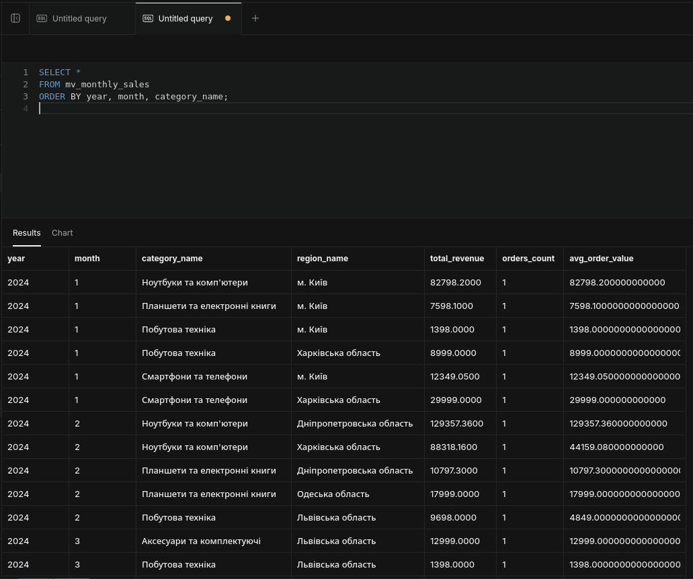

**Пояснення:**  
Матеріалізоване представлення зберігає результат складного запиту
фізично в базі даних. Це може підвищити швидкість виконання аналітичних
запитів, оскільки складні об'єднання та агрегатні обчислення не потрібно
виконувати щоразу заново. У разі зміни вихідних даних представлення
можна оновити командою `REFRESH MATERIALIZED VIEW`.

---

### Завдання 6.2. Рекурсивний запит для ієрархії співробітників

```sql
WITH RECURSIVE employee_hierarchy AS (

    SELECT
        employee_id,
        first_name,
        last_name,
        title,
        reports_to,
        0 AS level,
        CAST(
            last_name || ' ' || first_name
            AS VARCHAR(1000)
        ) AS hierarchy_path

    FROM employees
    WHERE reports_to IS NULL

    UNION ALL

    SELECT
        e.employee_id,
        e.first_name,
        e.last_name,
        e.title,
        e.reports_to,
        eh.level + 1,

        CAST(
            eh.hierarchy_path
            || ' -> '
            || e.last_name
            || ' '
            || e.first_name
            AS VARCHAR(1000)
        )

    FROM employees e
    JOIN employee_hierarchy eh
        ON e.reports_to = eh.employee_id
)

SELECT *
FROM employee_hierarchy
ORDER BY hierarchy_path;
```

**Результат виконання:**

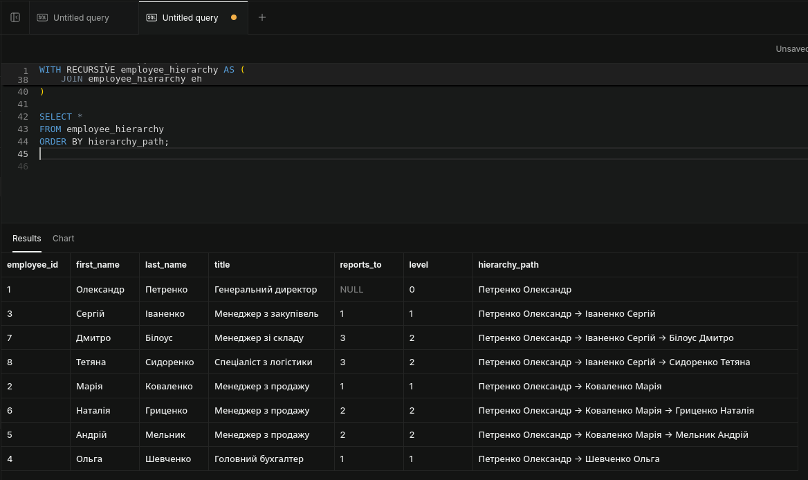

**Пояснення:**  
Рекурсивний CTE використовується для побудови ієрархічної структури
співробітників. Початковий запит знаходить працівників без керівника,
після чого рекурсивна частина послідовно знаходить їх підлеглих.
Поле `level` відображає рівень співробітника в ієрархії, а
`hierarchy_path` — шлях від керівника до працівника.

---

# Аналіз продуктивності

## Дослідження планів виконання

**Найповільніший запит:**

```sql
SELECT
    o.order_id,
    o.order_date,
    cu.contact_name,
    p.product_name,
    c.category_name,
    oi.quantity,
    oi.unit_price
FROM orders o
JOIN customers cu
    ON o.customer_id = cu.customer_id
JOIN order_items oi
    ON o.order_id = oi.order_id
JOIN products p
    ON oi.product_id = p.product_id
JOIN categories c
    ON p.category_id = c.category_id
ORDER BY o.order_date DESC;
```

**План виконання:**

```sql
EXPLAIN (ANALYZE, BUFFERS)
SELECT
    o.order_id,
    o.order_date,
    cu.contact_name,
    p.product_name,
    c.category_name,
    oi.quantity,
    oi.unit_price
FROM orders o
JOIN customers cu
    ON o.customer_id = cu.customer_id
JOIN order_items oi
    ON o.order_id = oi.order_id
JOIN products p
    ON oi.product_id = p.product_id
JOIN categories c
    ON p.category_id = c.category_id
ORDER BY o.order_date DESC;
```

**Результат EXPLAIN ANALYZE:**

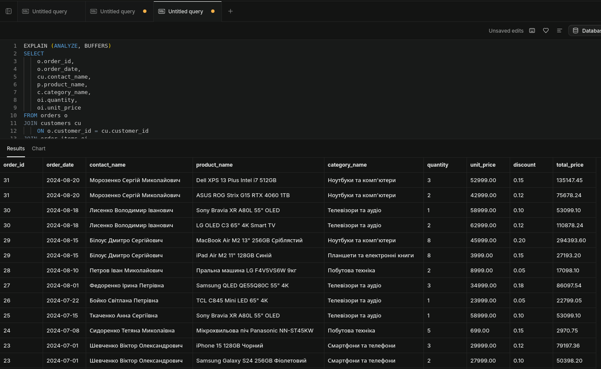

**Запропоновані оптимізації:**

1. Створити індекс для полів `customer_id` і `order_date` таблиці
   `orders`, які використовуються для з'єднання та сортування.
2. Створити складений індекс для полів `order_id` та `product_id`
   таблиці `order_items`, оскільки вони часто використовуються
   при з'єднанні таблиць.
3. Створити індекс для `category_id` та `unit_price` таблиці
   `products`, що може прискорити фільтрацію, групування та
   сортування товарів за категоріями і ціною.

---

## Створені індекси

### Індекс 1

```sql
CREATE INDEX IF NOT EXISTS idx_orders_customer_date
ON orders(customer_id, order_date);
```

**Обґрунтування:**  
Індекс може прискорити пошук замовлень конкретного клієнта,
з'єднання таблиць за `customer_id` та операції, пов'язані з датою
замовлення.

### Індекс 2

```sql
CREATE INDEX IF NOT EXISTS idx_order_items_order_product
ON order_items(order_id, product_id);
```

**Обґрунтування:**  
Індекс оптимізує з'єднання таблиці `order_items` з таблицями
`orders` і `products`, оскільки поля `order_id` та `product_id`
регулярно використовуються у `JOIN`.

### Індекс 3

```sql
CREATE INDEX IF NOT EXISTS idx_products_category_price
ON products(category_id, unit_price);
```

**Обґрунтування:**  
Індекс може покращити швидкість запитів, у яких товари відбираються,
групуються або сортуються за категорією та ціною.

**Результат створення індексів:**

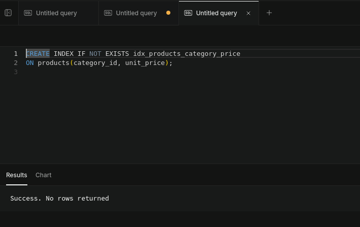

---

# Порівняльний аналіз

## Ефективність різних підходів

**Завдання:** знайти топ-5 найдорожчих товарів у кожній категорії.

### Підхід 1. Віконні функції

```sql
WITH ranked_products AS (
    SELECT
        p.product_id,
        p.product_name,
        p.category_id,
        p.unit_price,
        ROW_NUMBER() OVER (
            PARTITION BY p.category_id
            ORDER BY p.unit_price DESC, p.product_id
        ) AS rn
    FROM products p
)
SELECT
    rp.product_name,
    c.category_name,
    rp.unit_price
FROM ranked_products rp
JOIN categories c
    ON rp.category_id = c.category_id
WHERE rp.rn <= 5
ORDER BY c.category_name, rp.unit_price DESC;
```

**Результат:**

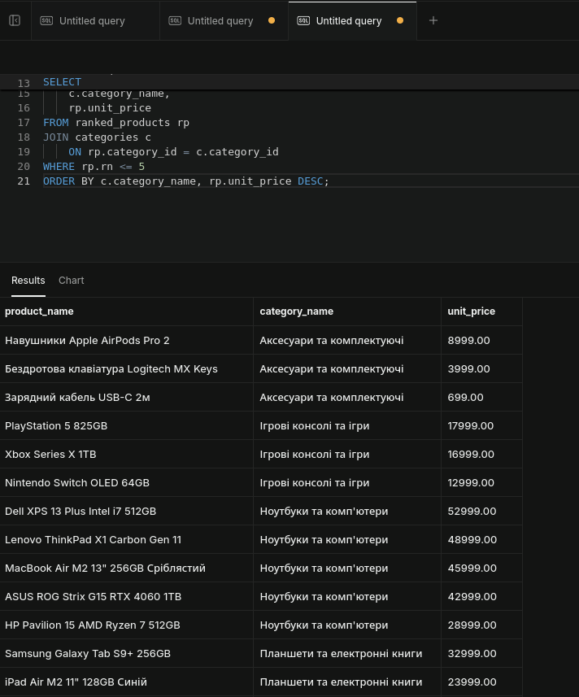

Час виконання був визначений за допомогою:

```sql
EXPLAIN ANALYZE
WITH ranked_products AS (
    SELECT
        p.product_id,
        p.product_name,
        p.category_id,
        p.unit_price,
        ROW_NUMBER() OVER (
            PARTITION BY p.category_id
            ORDER BY p.unit_price DESC, p.product_id
        ) AS rn
    FROM products p
)
SELECT
    rp.product_name,
    c.category_name,
    rp.unit_price
FROM ranked_products rp
JOIN categories c
    ON rp.category_id = c.category_id
WHERE rp.rn <= 5
ORDER BY c.category_name, rp.unit_price DESC;
```

**Execution Time:** `2.208 ms`

---

### Підхід 2. Корельований підзапит

```sql
SELECT
    p.product_name,
    c.category_name,
    p.unit_price
FROM products p
JOIN categories c
    ON p.category_id = c.category_id
WHERE (
    SELECT COUNT(*)
    FROM products p2
    WHERE p2.category_id = p.category_id
      AND (
          p2.unit_price > p.unit_price
          OR (
              p2.unit_price = p.unit_price
              AND p2.product_id < p.product_id
          )
      )
) < 5
ORDER BY c.category_name, p.unit_price DESC;
```

**Результат:**

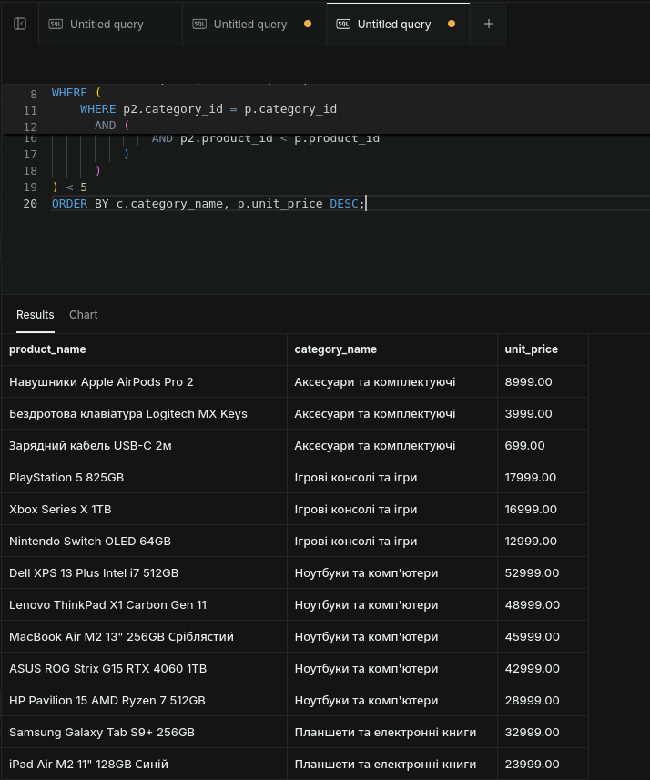

Час виконання був визначений за допомогою:

```sql
EXPLAIN ANALYZE
SELECT
    p.product_name,
    c.category_name,
    p.unit_price
FROM products p
JOIN categories c
    ON p.category_id = c.category_id
WHERE (
    SELECT COUNT(*)
    FROM products p2
    WHERE p2.category_id = p.category_id
      AND (
          p2.unit_price > p.unit_price
          OR (
              p2.unit_price = p.unit_price
              AND p2.product_id < p.product_id
          )
      )
) < 5
ORDER BY c.category_name, p.unit_price DESC;
```

**Execution Time:** `0.409 ms`

### Порівняння часу виконання

- Віконні функції: **2.208 ms**
- Корельований підзапит: **0.409 ms**

**Висновок:**  
За результатами проведеного тестування на поточному наборі даних
корельований підзапит виконався швидше, ніж запит із віконною функцією:
`0.409 ms` проти `2.208 ms`.

Такий результат може бути пов'язаний із невеликим обсягом навчальної
бази даних, особливостями плану виконання PostgreSQL та використанням
створених індексів. На більших наборах даних результати можуть
відрізнятися, тому ефективність запитів доцільно оцінювати за допомогою
`EXPLAIN ANALYZE` для конкретної бази даних.

---

# Висновки

Під час виконання лабораторної роботи було опрацьовано створення
складних SQL-запитів у PostgreSQL. Було використано різні типи
з'єднань таблиць: `INNER JOIN`, `LEFT JOIN`, `RIGHT JOIN` та
Self-join.

Було досліджено агрегатні функції `COUNT`, `AVG`, `MIN`, `MAX`
і `SUM`, оператори `GROUP BY` та `HAVING`, корельовані підзапити,
підзапити з `IN` та підзапити в секції `SELECT`.

Також було використано віконні функції `RANK`, `DENSE_RANK`,
`ROW_NUMBER`, `LAG` та `LEAD`. Для складніших операцій було створено
матеріалізоване представлення та рекурсивний CTE для побудови
ієрархії співробітників.

За допомогою `EXPLAIN ANALYZE` було досліджено план і час виконання
SQL-запитів та створено індекси для оптимізації роботи бази даних.

У ході порівняльного аналізу двох способів пошуку п'яти найдорожчих
товарів у кожній категорії було встановлено, що на поточному наборі
даних корельований підзапит виконався швидше — `0.409 ms`, тоді як
варіант із віконною функцією виконався за `2.208 ms`.

**Самооцінка:** 5

**Обґрунтування:**  
Усі завдання трьох рівнів складності виконано. Було реалізовано
з'єднання таблиць, агрегатні функції, підзапити, віконні функції,
матеріалізовані представлення, рекурсивний запит, аналіз продуктивності
та оптимізацію за допомогою індексів. До звіту додано результати
виконання SQL-запитів та проведено порівняльний аналіз їх ефективності.